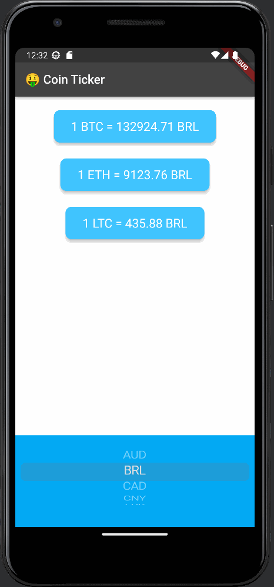

# Bitcoin-ticker

Application de suivi de prix BitCoin.

Ce projet est issu d'une [formation](https://www.udemy.com/course/flutter-bootcamp-with-dart/) complete sur udemy dispensée par Angela Yu.

Je suis cette formation en vue d'un stage en mai sur Flutter.

# Eléments travaillés

- Menu DropDown
- Boucles
- Composant Android != iOS
- API

# Materiel

- Flutter
- Android Studio
- Tablette Lenovo M-10 / Android 10
- Emulateur Pixel 3a / Android 13

# Ressources

- [Udemy / Angela Yu](https://www.udemy.com/course/flutter-bootcamp-with-dart/)
- API : [https://www.coinapi.io/](https://www.coinapi.io/)

# Fichiers principaux

- Main : [lib/main.dart](lib/main.dart)
- Page principale : [lib/price_screen.dart](lib/price_screen.dart)
- data : [lib/coin_data.dart](lib/coin_data.dart)

# Example Android

# Example iOS

